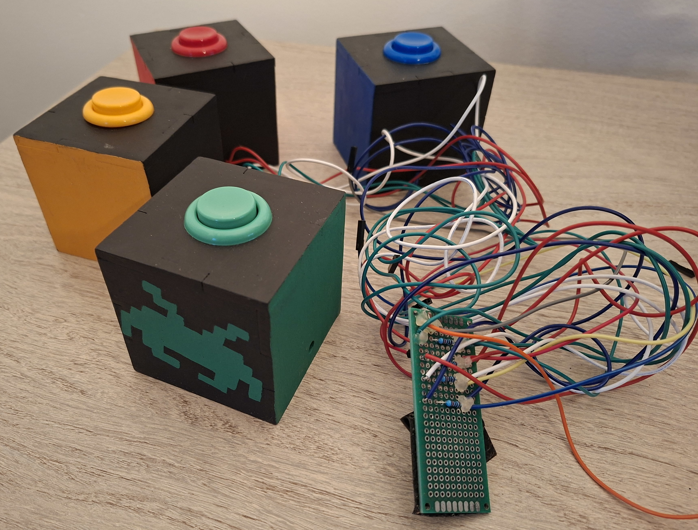
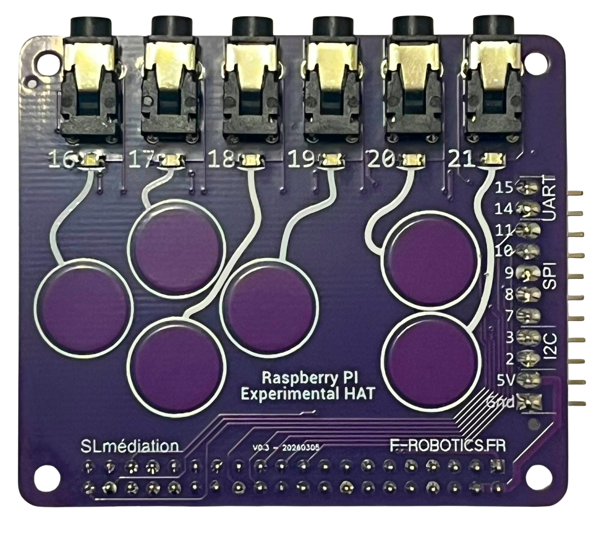
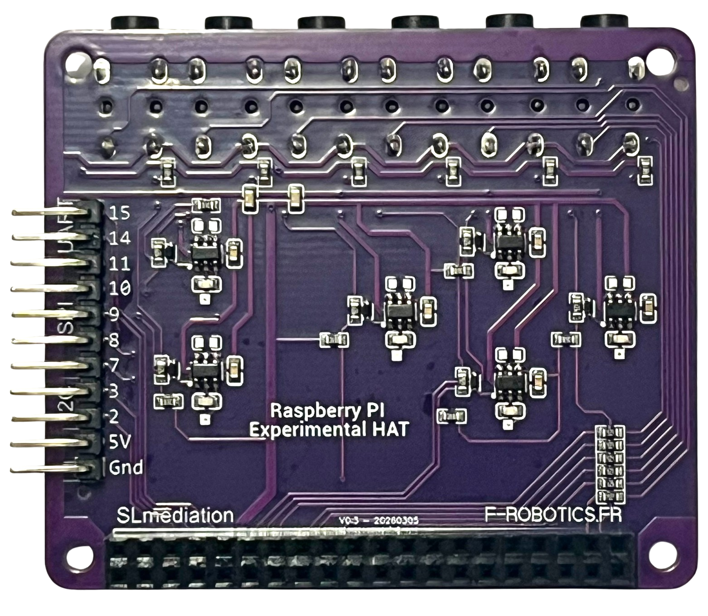
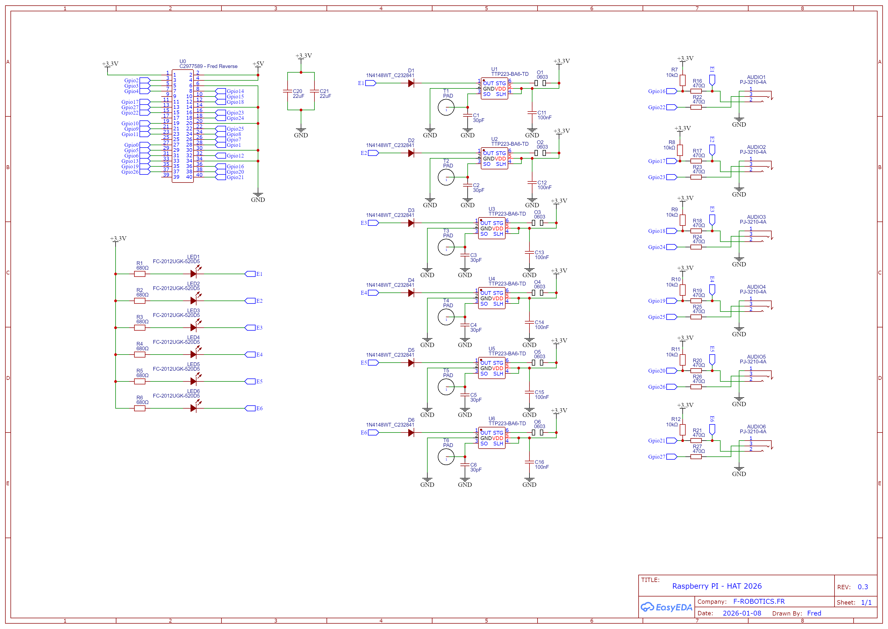
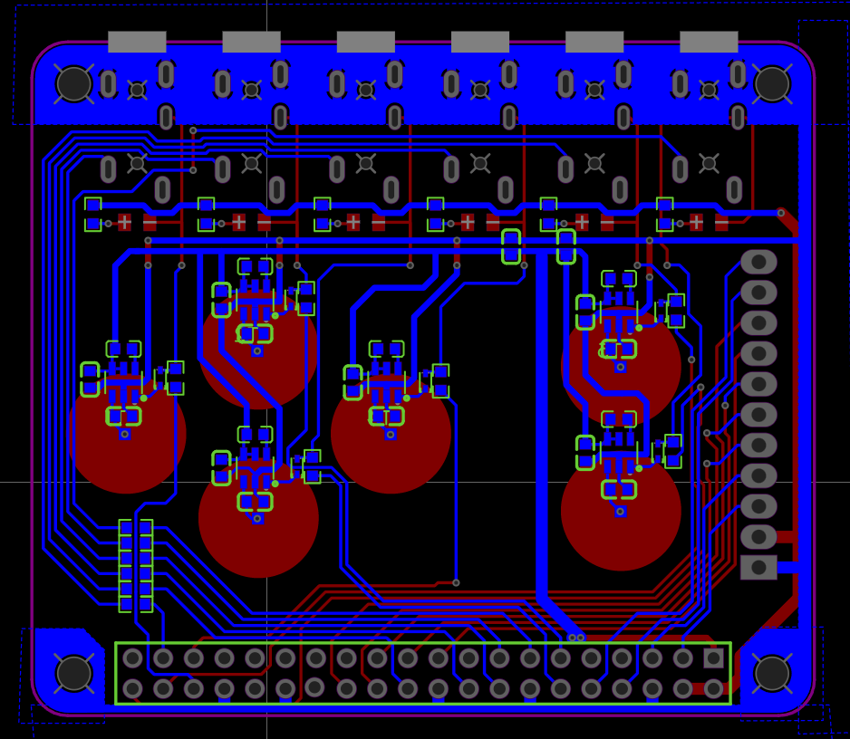
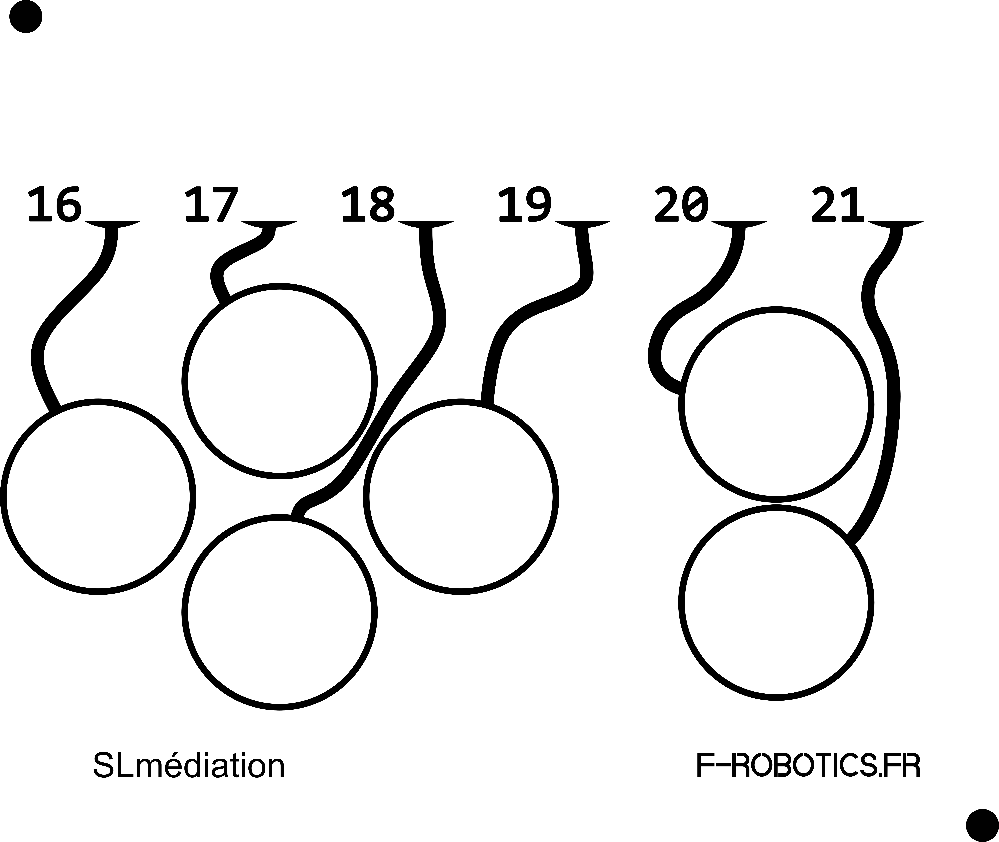

# Experimental Raspberry PI HAT 

_by SLmediation &amp; F-ROBOTICS.FR_

### Objectif du projet

* réaliser une petite carte pour Raspberry PI permettant le raccordement simplifié d'actionneurs type bouton poussoir  ... et peut-être un peu plus !
* éliminer les nombreux fils "spaghetti" ( même si on les aime bien tout de même )  

### Quelques contraintes dans notre cahier des charges :

* une carte Fun, sympa, visuellement reconnaissable
* simple à utiliser 
* interfaçable naturellement avec Scratch
* offrant certaines possibilités d'évolution ou d'utilisation avancée

### TODO

* partager ce projet et nos réflexions à la communauté Maker
* Trouver un nom à cette petite carte 

_et également :_ 

* continuer à documenter 
* et proposer des activités ludiques 

---

### Experimental Raspberry PI HAT - version 0.3

<table width="100%">
<td align="center"></td>
<td align="center"></td>
</table>

---

### Description de la carte 

la carte est composée de :

* 6 connecteurs type "Jack Stéréo 3.5mm"
    * chaque connecteur propose 2 Gpio + Gnd
    * possibilité d'utilisation en entrée ou en sortie 
* 6 Pads à détection capacitive
    * fonctionnent sans aucune programmation
    * disposent d'une LED témoin
* Gpios des bus I2C, SPI, UART en accès direct
    *  avec le +5v et Gnd

 

---

### Connecteurs JACK

Possibilité d'utiliser des connecteurs Jack 3.5mm monos ou stéréos

* **Gpio 16 à 21** en entrée/sortie **primaires** , et reliés aux Pads
* **Gpio 22 à 27** en entrée/sortie **secondaires**
    * uniquement en utilisant un Jack Stéréo

 

---

### Schéma simplifié

* les Gpio 16 à 21 dispose d'une résistance le pull-up de 10k
* les Gpio 16 à 27 sont protégés par une résistance de 470 ohms, en série, afin de limiter le courant de court circuit, en cas d'erreur de manipulation et/ou programmation

* Les Gpio des bus I2c, Spi, et Uart sont directement disponible

 

### Schéma 

<table width="100%">
<td align="center">
<td align="center"></td>

</table>

### Design

* Dessin vectoriel
* Utilisation de Inkscape
* Import dans EasyEDA

